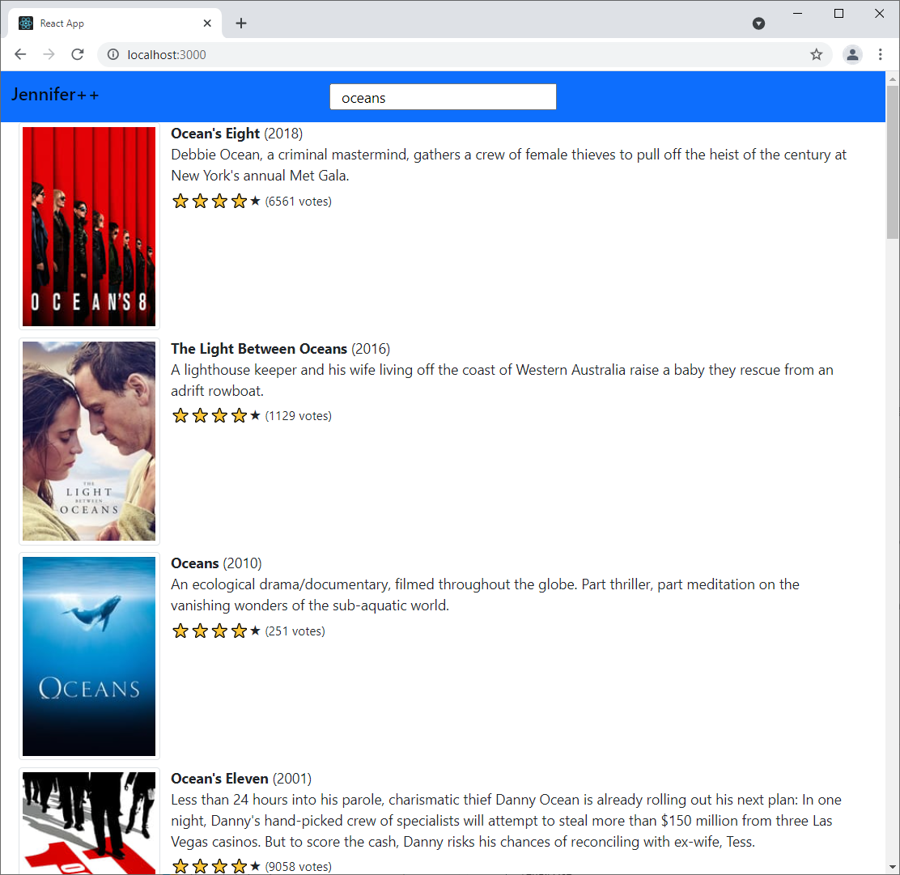

# Getting Started

This app is built with create-react-app, and it should be pretty easy to run. Just install the dependencies and then run the `start` script.

```bash
npm i
npm run start
```

# Design Decisions

## Logic
I built the react components entirely as function components, using hooks. To be honest, I haven't used react in a few years, and this seems to be the recommended approach for most cases.

I used the observer pattern, with service classes powered by RxJS to mediate communication between components and generally manage application state. I know redux is a more common way to do that. However, redux isn't very good at its stated goal of managing state and keeping components isolated from each other. Redux clients are required to implement reducers correctly, and badly implemented reducers can corrupt application state. Observables don't have that problem.

## Design

I kept pretty close to the provided wireframe, and I used Bootstrap for general styling. Bootstrap is fairly easy, and doesn't particularly rely on using its own components. Given this is a one-off interview exercise, I thought that would be for the best.

I tried to make the app as accessible as time allowed. In particular I made heavy use of semantic html elements. I also did some work to facilitate keyboard navigation through the list of search results.

Likewise, I tried to make the experience pleasant on mobile. The design is fluidly responsive, and works well down to quite small screen sizes. The search field highlights the current text on focus, which makes it easier to perform new searches with an on screen keyboard.

## Testing

Tests are pretty basic, although that's probably to be expected because the app doesn't do all that much anyway. I only did snapshot testing on my components. It would be better to also test the event handlers, but I already spent more time on this than I wanted to. The search service, which is the core functional piece of the app, is very thoroughly tested.

# Challenges

Honestly, the biggest challenge is that I'm not in the habit of building hobby project apps from scratch like this. Setting up tooling, organizing a project, and figuring out how to use libraries and frameworks that I'm not familiar with tend to be pretty uncommon events in real work.

I did run into a problem mocking an RxJS function that I wanted to use to manage the api calls. I tried several methods of mocking it, but nothing worked. So I had to use a raw fetch instead, and mocked that using an npm package.

# Future Enhancements

It might be interesting to implement the sharable links feature suggested in the spec document. In order to do that, I would likely want to implement a router to help manage those urls. I would also like to integrate the paging feature into those urls and allow the browser's back/forward feature to navigate through results pages.

In order to make this into more of a useful standalone application, I could imagine implementing a lists feature for things like movies a user owns, wants, etc. Without a backend, that could be stored in local storage.

TMDB provides search endpoints for people and tv shows, in addition to movies. I expect it would be straightforward to implement a similar feature for those searches. And it seems obvious to be able to open a detailed view for a selected movie (or person, etc) to see more information than the results list provides. 

# Screenshot


